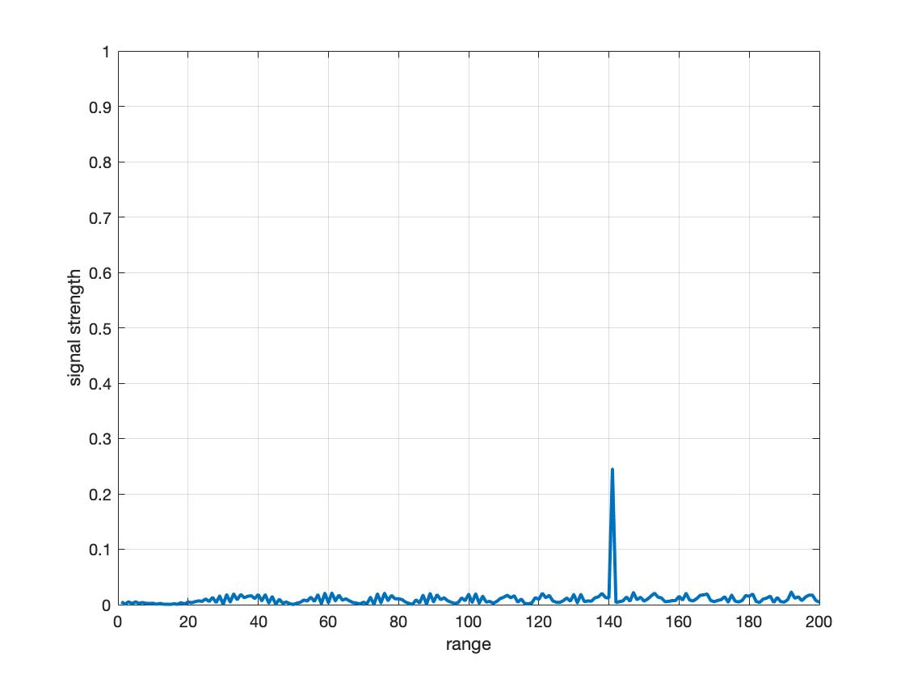
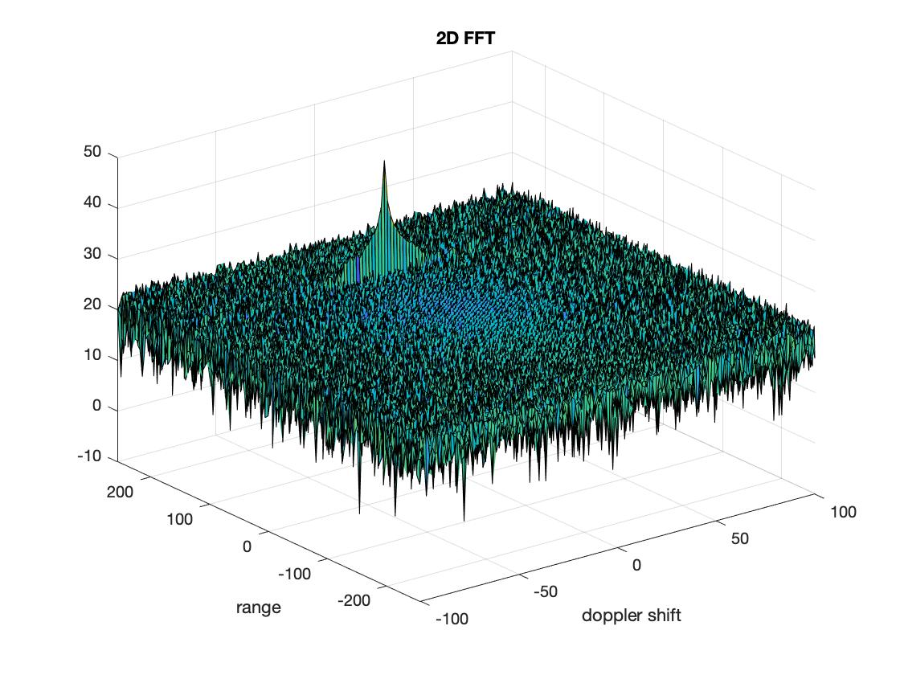
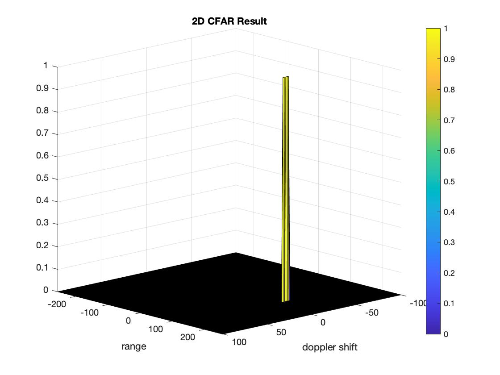

# radar_target_generation_and_detection

**Implementation steps for the 2D CFAR process**

1. Select the number of training cells, guard cells, and the offset, based on the environment, the signal leakage of CUT, and the signal-to-noise ratio(SNR).
2. Define the size of sliding window and the result matrix of 2D CFAR.
3. Loop through each cell under test in RDM matrix and subtract the sum of guard cell and CUT from the sum of the entire sliding window.
4. Take the average to get the noise. 
5. Add the offset to obtain the threshold.
6. Inside the result matrix, the value is assigned to 1 if the RDM value is larger than the threshold, otherwise assgned to 0.

**Selection of Training, Guard cells and offset**

- Training cells:

The number of training cells should be decided based on the environment. If a dense traffic scenario then the fewer training cells should be used, as closely spaced targets can impact the noise estimate.
```
T_r = 5
T_d = 8
```
- Guard cells:

The number of guard cells should be decided based on the leakage of the target signal out of the cell under test. If target reflections are strong they often get into surrounding bins.
```
G_r = 2
G_d = 2
```
- Offset:

It is related to the SNR. By trying different values, we can find out the suitable value that gives a clean surface plot(result of 2D CFAR without noisy signals).  
```
Offset = 8 (dB)
```


**Steps taken to suppress the non-thresholded cells at the edges**

Since the result matrix of 2D CFAR is defined as zero matrix, we don't have to deal with non thresholded cells. We only need to consider the value that are larger than the threshold, but this means that we give up the resolution around the edge of the entire matrix.






